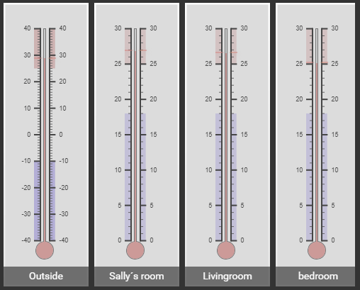
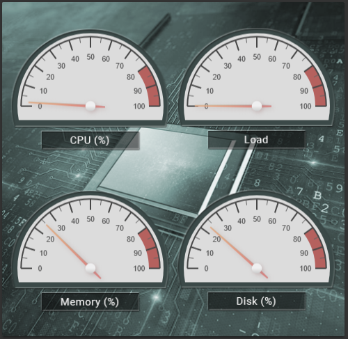
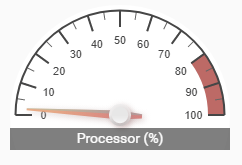
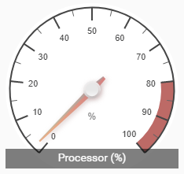
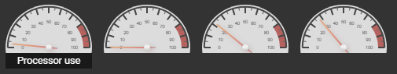

# canvas-gauge-card
This card allows you to use the awesome gauges at https://canvas-gauges.com/ in your lovelace GUI. This is still a very early and untested alpha version. Tested only on chrome and safari browsers. 

If you want to support the developer, please support the lib devs of the canvas-gauges.

## Screens 
Here is a some different screens from my own setup. But the possibilites to make your own look and feel are great.

<a href="docs/screen_1.png" target="_blank"></a>
<a href="docs/screen_2.png" target="_blank"></a>

## Usage
Download the files `canvas-gauge-card.js` and `gauge.min.js` to your home assistant config. Add a module link to the `canvas-gauge-card.js` file. The link needs to be the same as where you put it.
Example:
```yaml
resources:
  - url: /local/custom_cards/canvas-gauge-card.js
    type: module
```
Configure the card properties.

Skip `name`property if you dont want the name with the shadow area to show.

Use the javascript names of properties from the examples at https://canvas-gauges.com/documentation/examples/. Click on an example that you like, check the JS version and copy the properties to the lovelace yaml file. Just remove the ',' after copy from site. 

### Example 1, simple half gauge


**ui-lovelace.yaml:**

*Notice the differences in `card_height` and `gauge/height` to get correct half size for full circle, set both to same.*
```yaml
    - type: custom:canvas-gauge-card
      entity: sensor.processor_use
      card_height: 125
      gauge:
        type: "radial-gauge"
        title: Processor (%)
        width: 220
        height: 220
        minValue: 0
        maxValue: 100
        startAngle: 30
        ticksAngle: 180
        valueBox: false
        majorTicks: ["0", "10", "20", "30", "40", "50", "60", "70", "80", "90", "100"]
        minorTicks: 2
        strokeTicks: true
        highlights: [{"from": 80, "to": 100,"color": "rgba(200, 50, 50, .75)"}]
        borders: false
```
### Example 2, simple half gauge with shadow text


**ui-lovelace.yaml:**

```yaml
    - type: custom:canvas-gauge-card
      entity: sensor.processor_use
      name: Processor (%)
      card_height: 145
      shadow_height: 15%
      font_size: 1em
      gauge:
        type: "radial-gauge"
        width: 220
        height: 220
        minValue: 0
        maxValue: 100
        startAngle: 90
        ticksAngle: 180
        valueBox: false
        majorTicks: ["0", "10", "20", "30", "40", "50", "60", "70", "80", "90", "100"]
        minorTicks: 2
        strokeTicks: true
        highlights: [{"from": 80, "to": 100,"color": "rgba(200, 50, 50, .75)"}]
        borders: false   
```
### Example 3, simple full gauge with shadow text


**ui-lovelace.yaml:**

```yaml
    - type: custom:canvas-gauge-card
      entity: sensor.processor_use
      name: Processor (%)
      card_height: 210
      shadow_height: 12%
      font_size: 1em
      gauge:
        type: "radial-gauge"
        width: 220
        height: 220
        minValue: 0
        maxValue: 100
        startAngle: 40
        ticksAngle: 280
        valueBox: false
        units: "%"
        majorTicks: ["0", "10", "20", "30", "40", "50", "60", "70", "80", "90", "100"]
        minorTicks: 2
        strokeTicks: true
        highlights: [{"from": 80, "to": 100,"color": "rgba(200, 50, 50, .75)"}]
        borders: false
   
```

### Example 4, 4 gauges in a row in a horizontal-stack

This example shows gauges with or without text. This text are placed below the actual gauge this time.

**No text version**
```yaml
...
- type: horizontal-stack
  cards:
    - type: custom:canvas-gauge-card
      entity: sensor.load_1m
      card_height: 62
      gauge:
        type: "radial-gauge"
        width: 110
        height: 110
        minValue: 0
        maxValue: 100
        startAngle: 90
        ticksAngle: 180
        valueBox: false
        majorTicks: ["0", "10", "20", "30", "40", "50", "60", "70", "80", "90", "100"]
        minorTicks: 2
        strokeTicks: true
        highlights: [{"from": 80, "to": 100, "color": "rgba(200, 50, 50, .75)" }]
        colorPlate: "#ddd"
        borders: false
        needleType: "arrow"
        needleWidth: 2
        needleCircleSize: 7
        needleCircleOuter: true
        needleCircleInner: false
        animationDuration: 1500
        animationRule: "linear"
```
**With text version**
```yaml
...
- type: horizontal-stack
  cards:
    - type: custom:canvas-gauge-card
      entity: sensor.processor_use
      card_height: 62
      name: 'Processor use'
      shadow_height: "25%"
      font_size: 0.9em
      shadow_bottom: "20"
      gauge:
        type: "radial-gauge"
        width: 110
        height: 110
        minValue: 0
        maxValue: 100
        startAngle: 90
        ticksAngle: 180
        valueBox: false
        majorTicks: ["0", "10", "20", "30", "40", "50", "60", "70", "80", "90", "100"]
        minorTicks: 2
        strokeTicks: true
        highlights: [{"from": 80, "to": 100, "color": "rgba(200, 50, 50, .75)" }]
        colorPlate: "#ddd"
        borders: false
        needleType: "arrow"
        needleWidth: 2
        needleCircleSize: 7
        needleCircleOuter: true
        needleCircleInner: false
        animationDuration: 1500
        animationRule: "linear"

```

### Properties
Some of the properties that could be set. *italic* is not mandatory.

| Property |Description
|:---------|-----------
| entity | your sensor
| name | shows the name in shadow remove to hide it
| type | `"radial-gauge"` or `"linear-gauge"`
| width | width of the gauge
| height | height of the gauge
| *card_height*| the actual height of the card, set to smaller value than gauge height if using a half guage. Not use if using a full circle gauge.
| *font_size* | size of name, leave out it will be dynamic
| *shadow_height* | xx% of total height is shadow height
| *shadow_bottom* | how far below the gauge in pixels the shadow should apear 

For a complete documentation of available properties, please see https://canvas-gauges.com/documentation/user-guide/configuration

## Repos 
- [helto4real, Original cards](https://github.com/helto4real/lovelace-custom-cards)
- [helto4real, Tomas Hellströms, Hass config using the card](https://github.com/helto4real/hassio)


## Credits
- [Mikhus, canvas guages](https://github.com/Mikhus/canvas-gauges)
